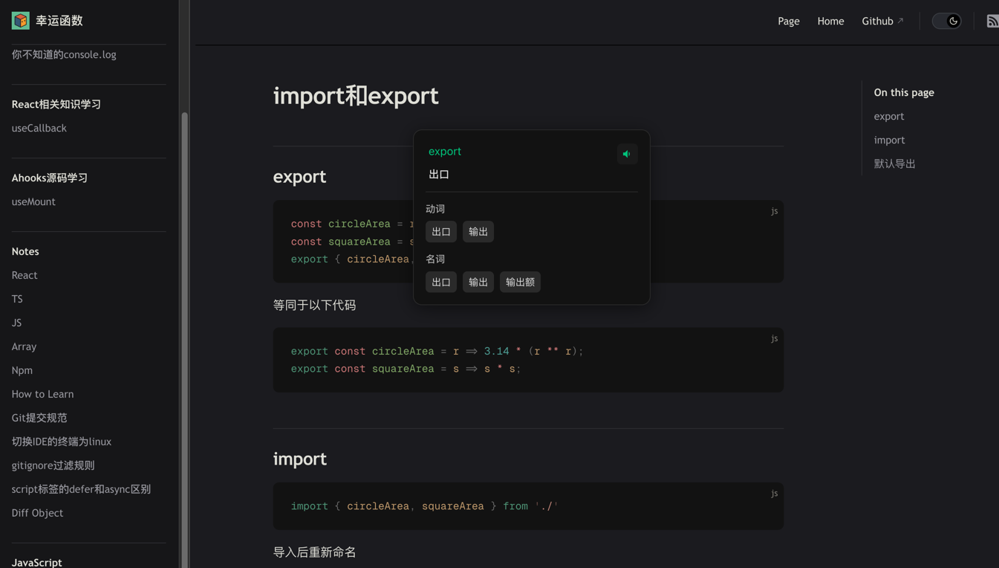

# Easy Select Translate

A Chrome extension that allows users to quickly translate selected text on any webpage.

## Features

- Quick translation by text selection
- Text-to-speech functionality
- Part of speech analysis
- Clean and intuitive UI
## Preview

## Installation

1. Clone this repository
```bash
git clone https://github.com/luckfunc/easy-select-translate.git
```
2. Open Chrome and navigate to `chrome://extensions/`
3. Enable "Developer mode"
4. Click "Load unpacked" and select the extension directory

## Usage

1. Select any text on a webpage
2. Click the translation icon that appears
3. View the translation in a popup window
4. Click the speaker icon to hear the pronunciation

## Author

- **LuckFunc**
- GitHub: [@luckfunc](https://github.com/luckfunc)

## License

This project is licensed under the MIT License - see the [LICENSE](LICENSE) file for details
