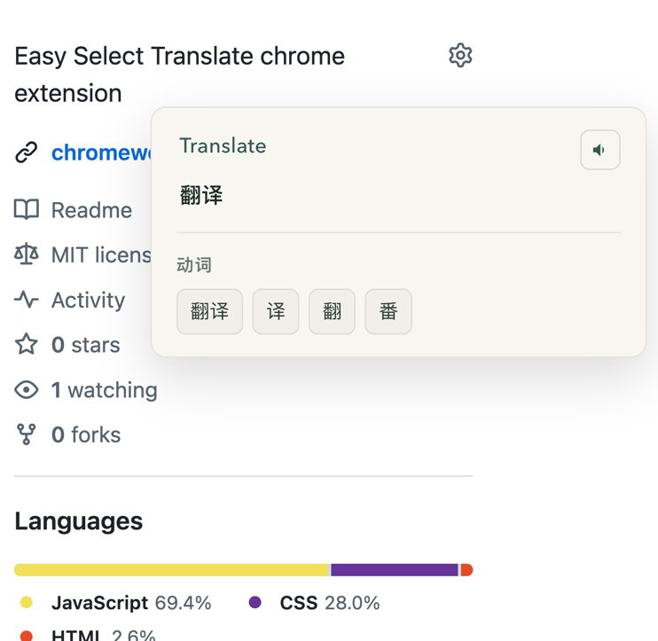

# Easy Select Translate

A Chrome extension that allows users to quickly translate selected text on any webpage.

## Features

- Quick translation by text selection
- DeepSeek API key support
- Google Translate fallback when no DeepSeek API key is configured
- Text-to-speech functionality
- Part of speech analysis for Google fallback results
- Clean and intuitive UI
## Preview

## Installation

1. Clone this repository
```bash
git clone https://github.com/luckfunc/easy-select-translate.git
```
2. Install dependencies and build the extension
```bash
npm install
npm run build
```
3. Open Chrome and navigate to `chrome://extensions/`
4. Enable "Developer mode"
5. Click "Load unpacked" and select the `dist` directory

## Development

```bash
npm run dev
```

The watch build writes extension files to `dist`. Reload the unpacked extension in Chrome after changes.

## Usage

1. Click the extension icon and save a DeepSeek API key if you want DeepSeek translations
2. Select any text on a webpage
3. Click the translation icon that appears
4. View the translation in the inline popup
5. Click the speaker icon to hear the pronunciation

If no DeepSeek API key is saved, the extension falls back to Google Translate.

## Author

- **LuckFunc**
- GitHub: [@luckfunc](https://github.com/luckfunc)

## License

This project is licensed under the MIT License - see the [LICENSE](LICENSE) file for details
